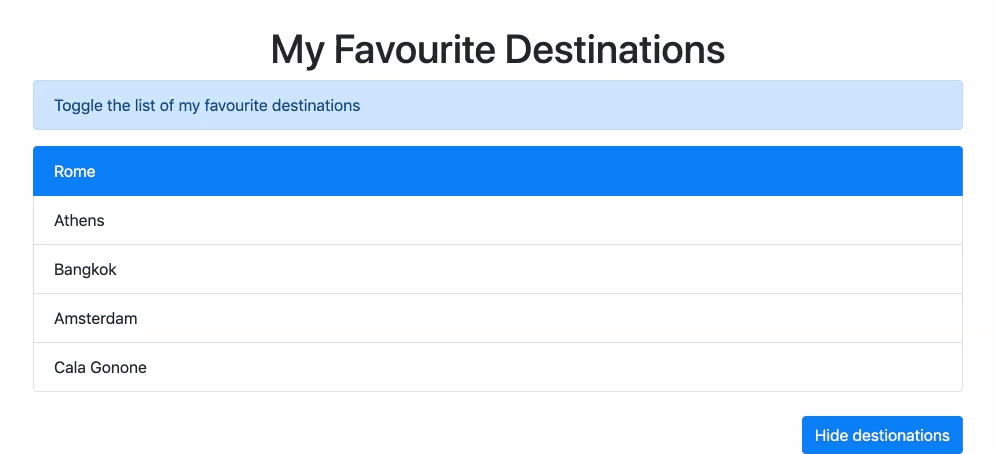

# Reiseziele Toggle

Mach eine Liste deiner Lieblings-Reiseziele mit einem Button um die Liste ein- und auszublenden

**Anforderungen:**
- Nutze Bootstrap CDN
- Nutze `Element.classList`-Methoden

**Vorlage:**

**Bonus:**

- Der Nutzer soll ein Ziel in der Liste auswählen können
- Das gewählte Ziel soll unter der Liste angezeigt werden
- Gib der Liste ein schöneres Design

